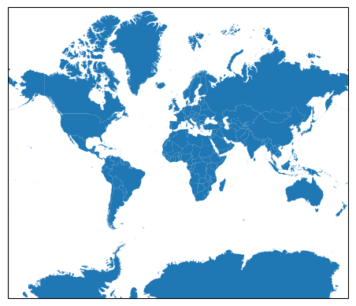

# EXERCÍCIO DE COMPARAÇÃO DE PAÍSES

## QUAIS SÃO OS 5 MAIORES PAÍSES DO MUNDO?

1. 
2. 
3. 
4. 
5.

## COMPARAR A GROELANDIA COM O BRAZIL NO SISTEMA 3857
- PAÍS 1: BRAZIL
- PAÍS 2: GREENLAND
- ROTATION: 17
- CRS PAÍS 1: 3857
- CRS PAÍS 1: 3857

## COMPARAR A GROELANDIA COM O BRAZIL CADA UM EM SEU SISTEMA DE COORDENADAS MAIS APROPRIADO
- PAÍS 1: BRAZIL
- PAÍS 2: GREENLAND
- ROTATION: 17
- CRS PAÍS 1: 5880
- CRS PAÍS 2: 5938

## COMPARAR A RÚSSIA COM OS ESTADOS UNIDOS NA PROJEÇÃO 3857
- PAÍS 1: RUSSIA
- PAÍS 2: UNITED STATES OF AMERICA
- ROTATION: 0
- CRS PAÍS 1: 3857
- CRS PAÍS 2: 3857

## COMPARAR A RÚSSIA COM OS ESTADOS UNIDOS NA PROJEÇÃO 3857
- PAÍS 1: RUSSIA
- PAÍS 2: UNITED STATES OF AMERICA
- ROTATION: 0
- CRS PAÍS 1: 5940
- CRS PAÍS 2: 3083

## COMPARAR A CHINA COM O BRASIL NA PROJEÇÃO 3857
- PAÍS 1: CHINA
- PAÍS 2: BRAZIL
- ROTATION: 0
- CRS PAÍS 1: 3415
- CRS PAÍS 2: 5880