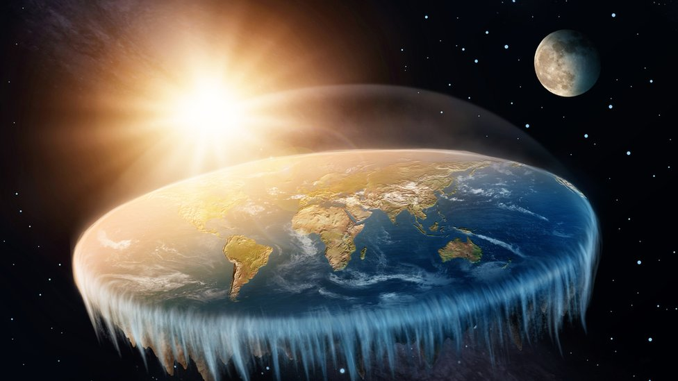
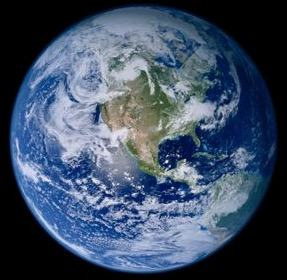
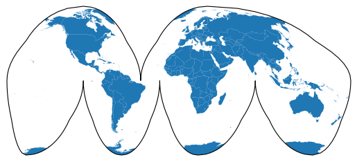
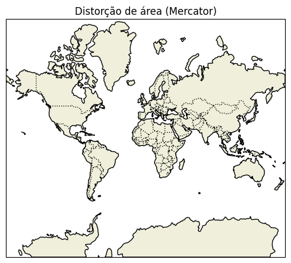
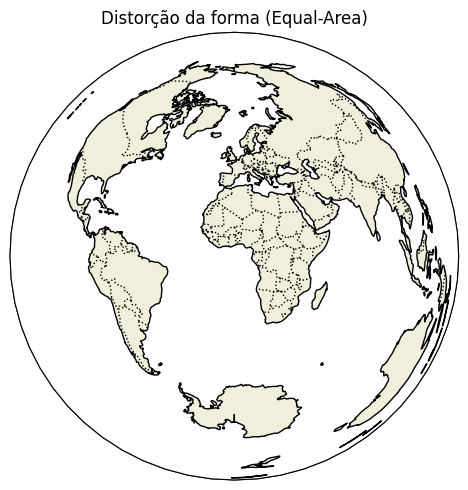
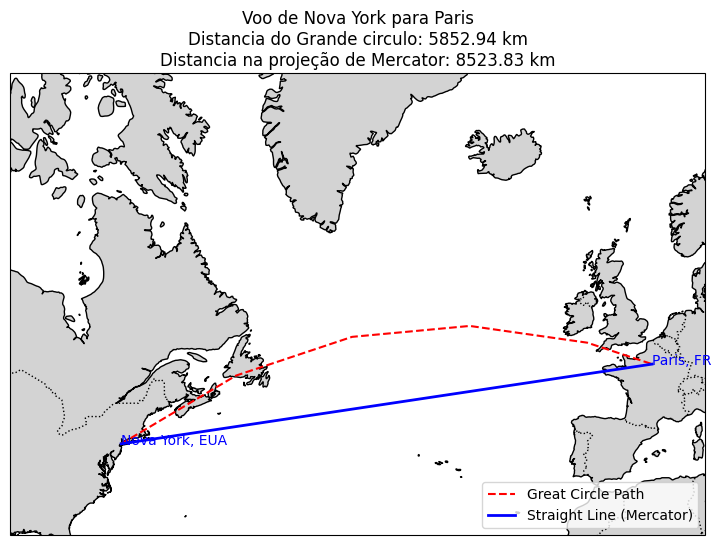

# O MUNDO COMO CONHECEMOS

- Alexandre Assunção - 25/02/2025

## O planeta Terra (Mundo)

          ## VS ##

## Qual o problema com essa imagem?

## Por que representamos o globo terrestre em 2D?
O planeta Terra é uma esfera (ou quase isso, já que tem um formato um pouco achatado nos polos). Mas quando precisamos criar mapas para estudar, viajar ou entender melhor o mundo, temos um problema: não dá para colocar um globo dentro de um livro, na tela do celular ou em um papel. Por isso, usamos projeções cartográficas, que transformam a superfície curva da Terra em um mapa plano.

No entanto, essa transformação não é perfeita. Imagine descascar uma laranja e tentar achatar a casca sobre uma mesa. Ela rasgaria ou ficaria enrugada, certo? Algo parecido acontece quando transformamos a Terra em um mapa plano. Sempre haverá alguma alteração nas características reais do planeta.

Dentre as 3 variáveis mais importantes relacionadas aos mapas, dependendo do tipo de projeção cartográfica usada, pelo menos uma será distorcida:

Área – Em algumas projeções, certas regiões parecem muito maiores ou menores do que realmente são. Um exemplo famoso é a projeção de Mercator, onde a Groenlândia parece quase do tamanho da América do Sul, mas na realidade, é bem menor.

Forma – Algumas projeções preservam a forma dos continentes e países, mas alteram seu tamanho. Isso é útil para navegação, pois mantém os ângulos corretos entre os pontos, mesmo que as áreas fiquem distorcidas.

Distância – Dependendo da projeção, a distância entre dois pontos pode parecer maior ou menor do que realmente é. Isso pode ser um problema, por exemplo, para aviões traçando rotas de voo.

Nenhuma projeção é perfeita, e a escolha do mapa depende do objetivo. Se quisermos representar bem a área dos países, usamos uma projeção que mantém as proporções. Se a prioridade for navegação, escolhemos outra que preserve a forma e os ângulos.

No fim, todo mapa é uma simplificação da realidade, e entender essas diferenças nos ajuda a interpretar melhor as informações geográficas.